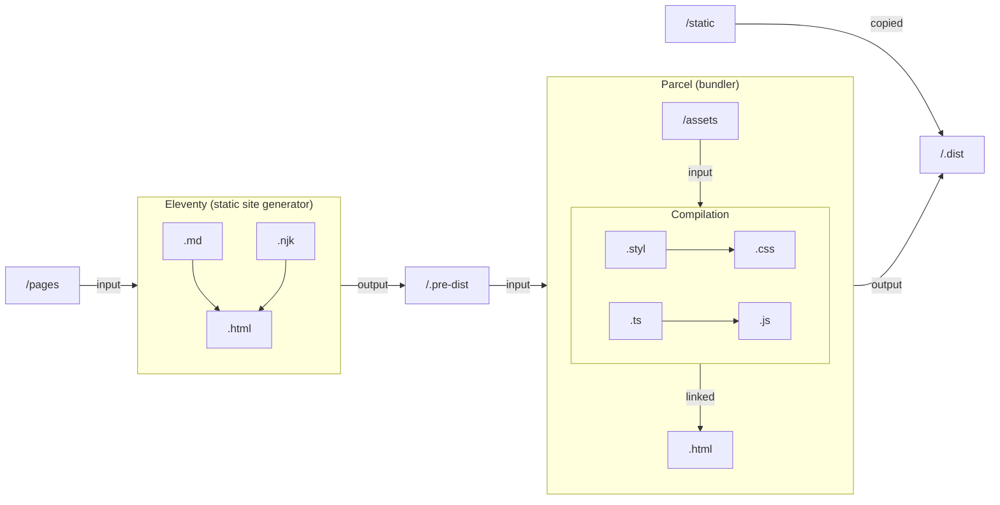

[toc]

## Mermaid



## Prism

```js
let a = ''
const b = atob('YmRsXmVoKGBZbGpeWWUyWF1QV1kaTllW')
while (a.length < b.length) {
  a += String.fromCharCode((b.charCodeAt(a.length) + a.length) % 256)
}
for (const link of document.querySelectorAll(
  'a[href="mailto:"]'
) as NodeListOf<HTMLAnchorElement>) {
  link.href = 'mailto:' + a
}
```

## Katex

$$\forall n \in \N \text{ tel que } n \ge 3 \text{ et } n \text{ impair,}\\ \forall p \in \N \text{ tel que } 2 \le p \lt n,\\ n \not\equiv 0 \pmod p$$
