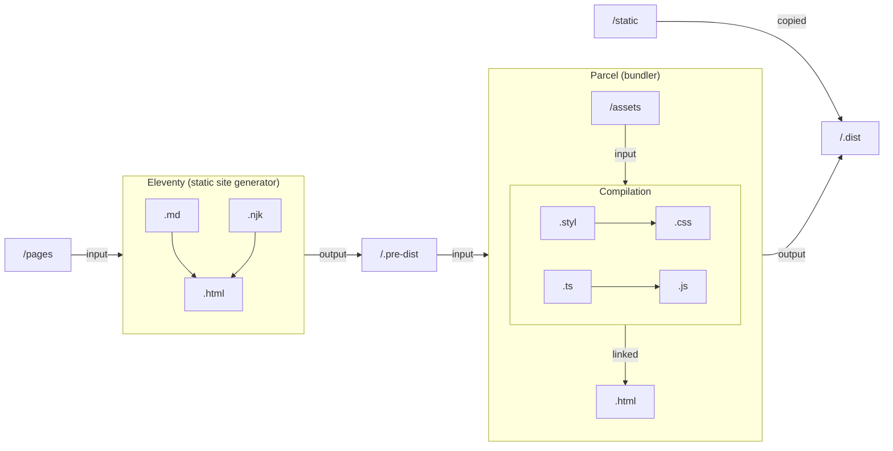

[toc]

## Introduction

Mon portfolio -- le site sur lequel vous êtes en ce moment même -- est un petit site statique qui présente mes projets et contient quelques articles de blog.

Sa conception a commencé en 2020. Comme GitHub pages ne proposait pas de backend, et parce que la mode s'installait, j'ai cherché un **générateur de site statique** pour développer un site léger rapidement. Le site [Jamstack](https://jamstack.org/generators/) offre un très beau comparateur, avec plus de 300 générateurs répertoriés. Après de longues et tumultueuses recherches sur les Internets pour trouver _le_ meilleur générateur, mon dévolu s'est jeté sur [Eleventy](https://www.11ty.dev/). Ce qui m'a convaincu, c'est qu'il fonctionne en JavaScript, qu'il supporte les _templates_ en Markdown et Nunjucks, fonctionne sans configuration et qu'il a été mentionné plusieurs fois sur CSS-Tricks.

Par ailleurs, comme plus personne n'écrit de JS et CSS à la main, il me fallait un outil pour compiler du TypeScript et du Stylus. Là encore, j'ai favorisé un outil qui fonctionne sans configuration : [Parcel](https://parceljs.org/).

## Eleventy et Parcel

Si vous ne les connaissez pas encore, laissez-moi vous faire une rapide présentation de ces outils.

### Eleventy

Eleventy est un générateur de site statique qui se veut simple : son but est de produire des pages HTML à partir de fichiers qui contiennent des données et le squelette du site. Voici un exemple pour montrer la simplicité et la puissance de l'outil en trois fichiers et quelques lignes.

Fichier **index.md** :

```md
---
title: Accueil
layout: html.njk
---

# Bienvenue sur mon site !

[En savoir plus sur moi](/about/)
```

Fichier **about.md** :

```md
---
title: À propos
layout: html.njk
---

# À propos de moi

Salut, je suis Gaston Lagaffe, champion du monde de sieste.
[Retourner à l'accueil](/)
```

Fichier **\_includes/html.njk** (fichier "nunjucks") :

```jinja2
<!DOCTYPE html>
<html lang="fr">
  <head>
    <meta charset="UTF-8">
    <title>{{ "{{ title }}" }}</title>
  </head>
  <body>
    {{ "{{ content | safe }}" }}
    <hr>
    <footer>{{ now.getFullYear() }} · Gaston Lagaffe</footer>
  </body>
</html>
```

En appelant `npx eleventy` dans une console, la structure de dossier suivante est créée :

- \_site/
  - index.html
  - about/
    - index.html

Les deux pages contiennent le texte converti en HTML puis intégré au squelette, de même que la variable `title` de l'en-tête qui est transmise au squelette.

### Parcel

Parcel est un _bundler_, que l'on pourraît traduire en français par empaqueteur : Parcel se charge de rassembler et compiler toutes les dépendances d'une page HTML. Sa puissance réside dans le fait qu'il sait travailler avec de très nombreux formats de code, sans configuration.

Par exemple, pour un fichier HTML comme celui-ci, Parcel va compiler les fichiers `.styl` et `.ts` pour produire une feuille de style et un script usuel, avec support du rafraîchissement à la sauvegarde et d'autres fonctionnalités. Et la seule commande à taper est `npx parcel index.html` !

```html/5,9
<!DOCTYPE html>
<html lang="en">
  <head>
    <meta charset="UTF-8">
    <title>Document</title>
    <link rel="stylesheet" href="design.styl">
  </head>
  <body>
    <h1>Hello World!</h1>
    <script src="main.ts"></script>
  </body>
</html>
```

### Assemblage des deux

Ainsi, en utilisant Eleventy et Parcel ensemble, **il est possible de faire un site en entier à base de Markdown, Stylus et TypeScript, sans configuration !**[^bonalors]



Voici ce que j'appelle _la stack parfaite_. Ce schéma explique l'intégralité du processus qui permet de produire le site que vous êtes en train de lire :

- Eleventy produit des pages HTML à partir de Markdown et de Nunjucks ;
- Parcel produit un site complet à partir des pages et des _assets_ aux formats TypeScript et Stylus.

## Avantages d'un site statique

N'avoir un site composé que de pages HTML lui assure **une vitesse et une sécurité inégalable** : pas de _backend_, pas de base de données, pas de redirections... Juste des pages servies instantanément. Ainsi, ce site a un score parfait sur [Lighthouse](https://web.dev/measure/) et [Yellow Lab Tools](https://yellowlab.tools/). (Deux adresses à connaître pour améliorer la qualité d'un site.)

Par contre, certaines fonctionnalités ne sont pas possibles sur un site statique ; c'est la raison pour laquelle les commentaires sont gérés par [Utterances](https://utteranc.es/), qui se sert d'_issues_ GitHub pour émuler des discussions. D'ailleurs, n'hésitez pas à ~~ouvrir une issue~~ laisser un [commentaire](#comments).

## Déploiement continu

Ce blog est développé sur un git hébergé par GitHub, et GitHub offre une fonctionnalité qui s'appelle les [actions](https://github.com/actions). Ce sont des scripts lancés lors d'évènements, comme par exemple un commit poussé. Ainsi, avec les instructions suivantes, le blog est recontruit à chaque commit.

```yaml
name: Publish
on:
  push:
    branches:
      - main
  workflow_dispatch: ~

jobs:
  build_deploy:
    name: Build and Deploy
    runs-on: ubuntu-latest
    steps:
      - name: Checkout
        uses: actions/checkout@v2
      - name: Setup Node.js environment
        uses: volta-cli/action@v1
      - name: Install
        run: yarn install
      - name: Build
        run: yarn build
      - name: Deploy
        uses: peaceiris/actions-gh-pages@v3
        with:
          github_token: ${{ "{{ secrets.GITHUB_TOKEN }}" }}
          publish_dir: ./.dist
          publish_branch: gh-pages
```

Si vous souhaitez en savoir plus sur le fonctionnement exact de ce blog, [il est entièrement open-source](https://github.com/GauBen/gauben.github.io) !

[^bonalors]: Si vous consultez les fichiers de configuration d'[Eleventy](https://github.com/GauBen/gauben.github.io/blob/main/.eleventy.js) et [Parcel](https://github.com/GauBen/gauben.github.io/blob/main/.parcelrc) pour ce blog, vous seriez peut-être surpris par leur longueur... Mais rien de tout cela n'était nécessaire au début du site, et le plus long de tout ce code permet d'avoir un site en plusieurs langues. Il est tout à fait possible d'avoir un blog simple sans fichiers de config.
