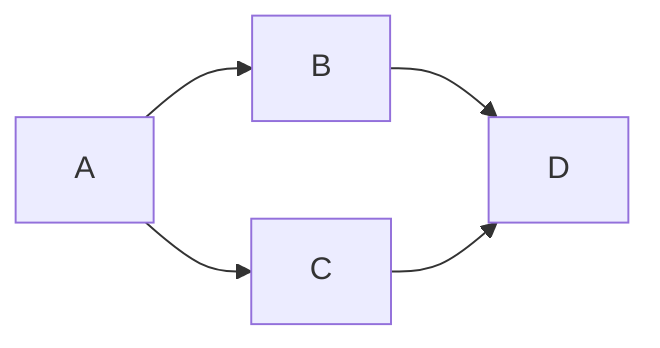

## Titre 2

### Titre 3

#### Titre 4

##### Titre 5

###### Titre 6

Emphasis, aka italics, with _asterisks_ or _underscores_.

Strong emphasis, aka bold, with **asterisks** or **underscores**.

Combined emphasis with **asterisks and _underscores_**.

Strikethrough uses two tildes. ~~Scratch this.~~

- List
  - Sub
    - List
- Item

1. List
   1. Sub
      1. List
1. Item

My to-do:

- [x] Done
- [ ] In progress

Lorem ipsum dolor sit amet consectetur, adipisicing elit. Eveniet, aut? Perferendis omnis veritatis maxime reprehenderit, eligendi totam soluta consectetur aperiam voluptate qui alias fugit optio in doloremque atque nesciunt officiis!

> "Hello World!"
>
> -- <cite>main.c</cite>

And a mail thread:

> > a@example.com wrote:
> >
> > Hey
>
> b@example.com wrote:
>
> Oh!

A [link](http://example.com 'Title').

And a clickable picture [](https://example.org).

```
ssh-rsa AAAAB3NzaC1yc2E...NolV2QYs0AwLqp3PNw== me@example.com
ssh-rsa BBBBB3NzaC1yc2E...NolV2QYs0AwLqp3PNw== me@example.org
```

```html
<p class="warning">⚠&nbsp;Password too short.</p>
```

## Emojis?! Déjà été! 🤔


[](https://picsum.photos)

## Latex/Katex

In a paragraph, $n \ge 6$ and $n<7$.

$$
f(x) = \int_{-\infty}^\infty
    \hat f(\xi)\,e^{2 \pi i \xi x}
    \,d\xi
$$

## Tables

| Python | JavaScript |
| ------ | ---------- |
| black  | prettier   |
| pylint | eslint     |
| pip    | yarn       |

[Title]

|--|--|--|--|--|--|--|--|
|♜| |♝|♛|♚|♝|♞|♜|
| |♟|♟|♟| |♟|♟|♟|
|♟| |♞| | | | | |
| |♗| | |♟| | | |
| | | | |♙| | | |
| | | | | |♘| | |
|♙|♙|♙|♙| |♙|♙|♙|
|♖|♘|♗|♕|♔| | |♖|
[My best game so far]

## Horizontal Rule

Hey

---

Oh

## Mermaid



## Footnotes

Footnotes are cool.[^cool]

[^cool]: That's true!

    ```js
    console.log('And code works here too.')
    ```
